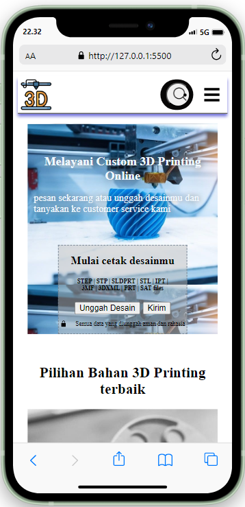

[](https://classroom.github.com/a/_e9whi2b)


 
---
## Welcome to 3D-Print website
### Structure
- Header
  - Navbar
    - Menu Navbar 1
    - Menu Navbar 2
- Main
  - Section 1 (Upload files print)
  - Section 2 (About us)
  - Section 3 (Client)
  - Section 4 (Achievement)
- Footer

### Ingredients I Use
- Html
- CSS

### How to Set Up
You will need a github account to clone this repository, make sure you're connected to github.

1. Clone this repository
    ```
    git clone https://github.com/revou-fsse-3/milestone-1-usman4li.git
    ```
2. Develop & modify the website with your personal information, once it's done you will need to push it.
    ```
    git add .
    git commit -m "update message" // make sure to give details commit message to get better logs
    git push origin main (name branch)
    ```
3. Once you're done, you can merge into main branch for production build.
    ```
    git checkout main
    git pull origin main // pull the latest version before commit merge
    git merge develop // if there are any conflicts, you should resolve them manually
    git commit -m "Merge develop into main"
    git push origin main
    ```

### Deployment
The Project has been successfully deployed using Netlify. You can access the production version of the website by following this link : [this link] (https://milestone-1-usman4li.netlify.app)

#### Deployment status :
[![Netlify Status]](https://milestone-1-usman4li.almanit.site)

1.  Connect your account to Netlify

    The first step to deploy in Netlify is creating a new account or use existing account. As a beginner progammer, I would prefer using GitHub account instead.

    After you successfully login, you will be redirected to dashboard of Netlify app. In this scenario, you will need to import your existing project from github to netlify. Add new site -> Import existing project -> Connect via GitHub

2. Auto Deploy with Netlify

    One of the benefit using your GitHub account connected to Netlify is that you don't have to worry about re-deploying your project manually, once there are changes that have been pushed in your repository, it will automatically re-deployed by Netlify within second.

3. Domain Registrar with NiagaHoster

    Go to [https://niagahoster.co.id](https://niagahoster.co.id) and log in or create a new account. Check available domain that you wanted and make it yours.

4. Modify your project with previous customize domain !

    You're on the final step to bringing live your project with previous domain.

5. Congratulations, You're done !

    You should wait within 1x24 hours to let the NiagaHoster
    